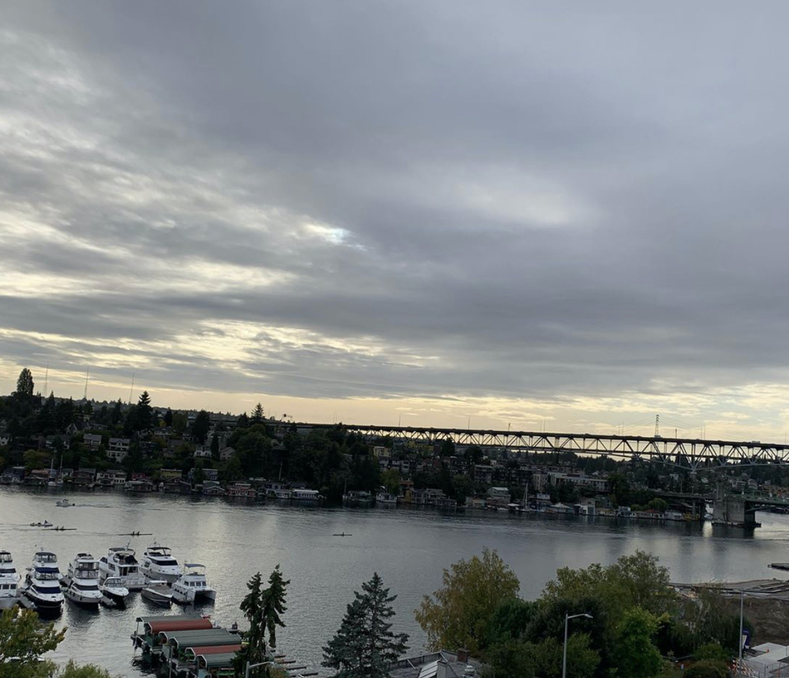

---
# Feel free to add content and custom Front Matter to this file.
# To modify the layout, see https://jekyllrb.com/docs/themes/#overriding-theme-defaults

layout: home
title: Welcome!
---

Hi, I'm Zorian!

I'm a PhD candidate in the [Department of Genome Sciences](https://www.gs.washington.edu) at the University of Washington.
I am currently working with [Erick Matsen](https://matsen.fredhutch.org) at the [Fred Hutch Cancer Research Center](https://www.fredhutch.org/en.html).
My research interests currently involve the intersection of statistics and machine learning, virology, immunology and evolution.
I completed my undergraduate education at Virginia Tech where I obtained degrees in statistics and computational modeling and data analytics (CMDA). I also worked with [Leah Johnson](http://leah.johnson-gramacy.com/QED/) and [Allison Tegge](https://www.stat.vt.edu/people/stat-faculty/tegge-allison.html).

Outside of science and classwork, I love blogging :black_nib: and vlogging :video_camera: (stay tuned for these!) as well as powerlifting :muscle: and playing video games :video_game:!
Feel free to connect with me via the links on the sidebar! :relaxed:

